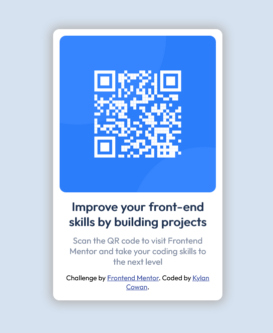

# Frontend Mentor - QR code component solution

This is a solution to the [QR code component challenge on Frontend Mentor](https://www.frontendmentor.io/challenges/qr-code-component-iux_sIO_H). Frontend Mentor challenges help you improve your coding skills by building realistic projects. 

## Table of contents

- [Overview](#overview)
  - [Screenshot](#screenshot)
  - [Links](#links)
- [My process](#my-process)
  - [Built with](#built-with)
  - [Continued development](#continued-development)
- [Author](#author)

## Overview

The project was to design a QR Code page that told visitors a small amount about the Frontend Mentor website and what it offers.

### Screenshot

### Links

- Solution URL: https://www.frontendmentor.io/solutions/handwritten-htmlcss-qr-code-page-7aJ34o5jfo
- Live Site URL: https://kccode2002.github.io/FrontEnd-Mentor-QR-Code/

## My process

I always start my work with a visual breakdown of what elements I need, how I would group and position them, and then think on how to implement that.
In terms of HTML/CSS, I start by getting all my content onto the page without any styling, then focus on getting elements where I need them to be before colors or fonts.

### Built with

- Semantic HTML5 markup
- CSS
- Flexbox
- No Frameworks or Libraries

### Continued development

In my future projects I'd like to start adding the work to Github repo's as I work, This will not only get me used to using Github but also in the case that I need help, I have the files available for anyone to see easily.

## Post Completion Errors

- Missing Alt Text On Image

## Author

- Frontend Mentor - [@KCCode2002]https://www.frontendmentor.io/profile/KCCode2002

